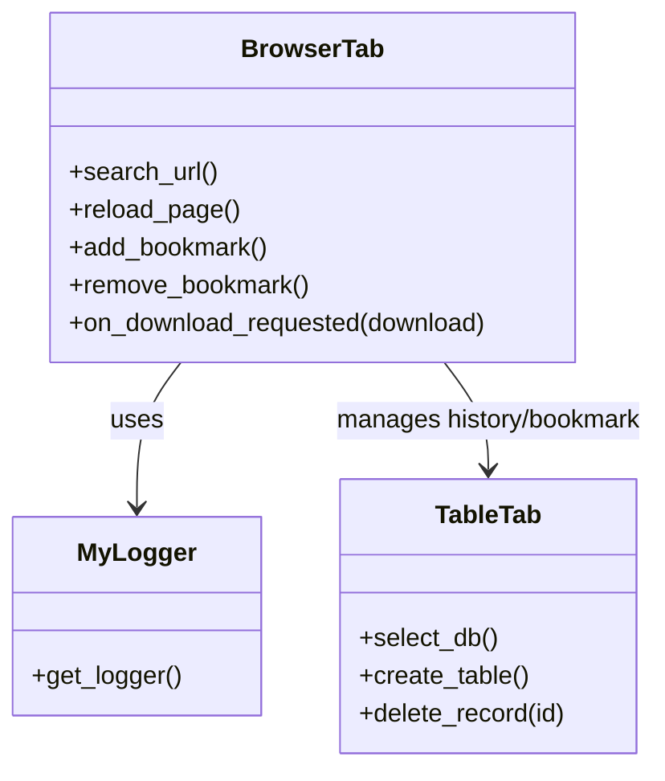

# マイブラウザ

## 概要
このプロジェクトは、PySide6を用いたシンプルなWebブラウザアプリケーションです。  
履歴管理、ブックマーク機能、ダウンロード機能などを備え、ブラウザタブおよびテーブル表示で情報を管理します。

## システム要件
- Python 3.8以上

## パッケージ情報
- PySide6: GUI構築用ライブラリ
- pytest: テスト実行用ライブラリ
- tinydb: 軽量データベース
- qtawesome: アイコン利用用ライブラリ  
- その他依存パッケージは requirements.txt をご参照ください

## アプリの機能
- Webページの閲覧とダウンロード機能
- 履歴およびブックマークのDB管理（TinyDB使用）
- ブラウザタブによる複数ページの同時操作
- テーブルタブを利用した履歴/ブックマーク一覧表示

## インストール
1. 必要な依存パッケージをインストールします:
   ```
   pip install -r requirements.txt
   ```
2. プロジェクトディレクトリに移動します:
   ```
   cd /c:/Users/grove/OneDrive/Desktop/開発/my_browser
   ```

## 使い方
- アプリの起動:
  ```
  python main_window.py
  ```
- メニューやショートカット (例: Ctrl+S, Ctrl+F) により操作が可能です。

## テストの実行
テストは [pytest](https://docs.pytest.org/) を用いて実行します:
```
pytest
```

## クラス図


